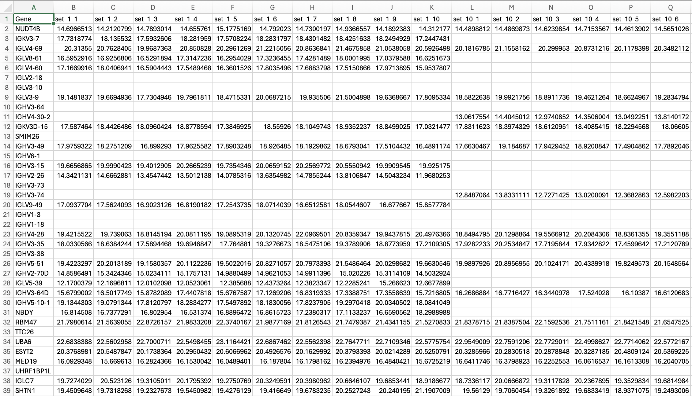
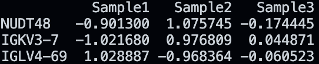

# Proteomagic: Proteomic Analysis in Python

## Table of Contents

1. [Download](#download-proteomagic)
2. [Dependancies](#dependancies)
3. [Creating a Proteomagic Object](#creating-a-proteomagic-object)
4. [Normalization](#normalization)

## Download Proteomagic

```bash
pip install Proteomagic
```

## Dependancies
1. [pandas==2.2.0](https://pandas.pydata.org/docs/whatsnew/v1.5.3.html)

## Creating a Proteomagic Object

### 1. pandas DataFrame

If your proteomic data is already in a pandas DataFrame with samples in columns and proteins in rows (index: protein gene symbols) you can generate a proteomagic object as follows:

```python
import pandas as pd
from Proteomagic import Proteomagic

protein_dict = {
    'ProteinNames': ['protein1', 'protein2', 'protein3'],
    'Sample1': [20.1, 32.4, 30.2],
    'Sample2': [42.3, 32.1, 21.3],
    'Sample3': [33.2, 13.4, 53.3]
}
df = pd.DataFrame(protein_dict, index='ProteinNames')

pm = Proteomagic(df)
```

### 2. CSV file

A CSV file in the proper orientation (see below) can be directly imported into a proteomagic object as follows: 

```python
from Proteomagic import Proteomagic

pm = Proteomagic.fromcsv('path/to/proteomic_csv_file.csv')
```
proper orientation: 

- protein gene names (`NUDT48`) are in the first column
- sample/patient (`set_1_1`) names are the column headers
- protein expression data populates the remaining matrix



### 3. Dictionary

to generate a proteomagic object from a python dictionary, ensure you first key: [value] represents ProteinNames: [Protein1Name, Protein2Name, Protein3Name], and all subsequent keys: values contain SampleName: [expGene1, expGene2, expGene3] as shown below

```python
from Proteomagic import Proteomagic

dict = {
    'proteins': ['NUDT48', 'IGKV3-7', 'IGLV4-69'],
    'Sample1': [12.5, 13.2, 43.2],
    'Sample2': [19.3, 32.5, 23.4],
    'Sample3': [15, 23.5, 32.4]
}

pm = Proteomagic.fromdict(dict)
```

## Normalization

to apply a normalization proceedure to your Proteomagic object you simply need to call the normalization function. This function has several methods including: `zscore`, ... you may select your normalization technique by assigning a method in function below:

```python 
from Proteomagic import Proteomagic

dict = {
    'proteins': ['NUDT48', 'IGKV3-7', 'IGLV4-69'],
    'Sample1': [12.5, 13.2, 43.2],
    'Sample2': [19.3, 32.5, 23.4],
    'Sample3': [15, 23.5, 32.4]
}

pm = Proteomagic.fromdict(dict)
pm.normalization(method='zscore')
print(pm.data)
```
this should return: 



